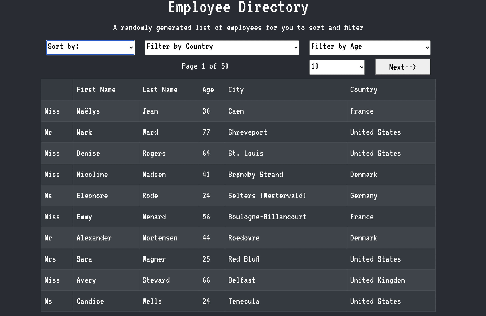

# Employee-Directory

## About

This React app displays, filters, and sorts fictional employee data. Deployed application can be found at [employee-tracker](https://www.jacobaf.com/employee-directory/)

## Table of Contents

- [Usage](#Usage)
- [Contributions](#Contributions)
- [Testing](#Testing)
- [Credits](#Credits)
- [License](#License)
- [Contact](#Contact)

## Usage

Employee Tracker will display a table of 500 randomly generated users from the [randomuser.me](https://randomuser.me/) API. Dropdown menus allow for sorting by first name, last name, age, and city. The employees can also be filter by country and age ranges. The user can change how many records are viewed at once and move through pages of results.

## Contributions

Contributions can be made by forking the repository on gitHub and submitting a pull request.

The repository can be found at [employee-directory](https://github.com/jacob-af/employee-directory)

## Testing

No testing suite was used for this development.

## Credits

This project is the sole work of Jacob A Feiitler.

## License:

This project is licensed under the MIT license.

## Contact

You can view my GitHub profile at [github.com/jacob-af](https://github.com/jacob-af)

If you have any questions, comments, or suggestions you can send email to <jfeitler@gmail.com>.
